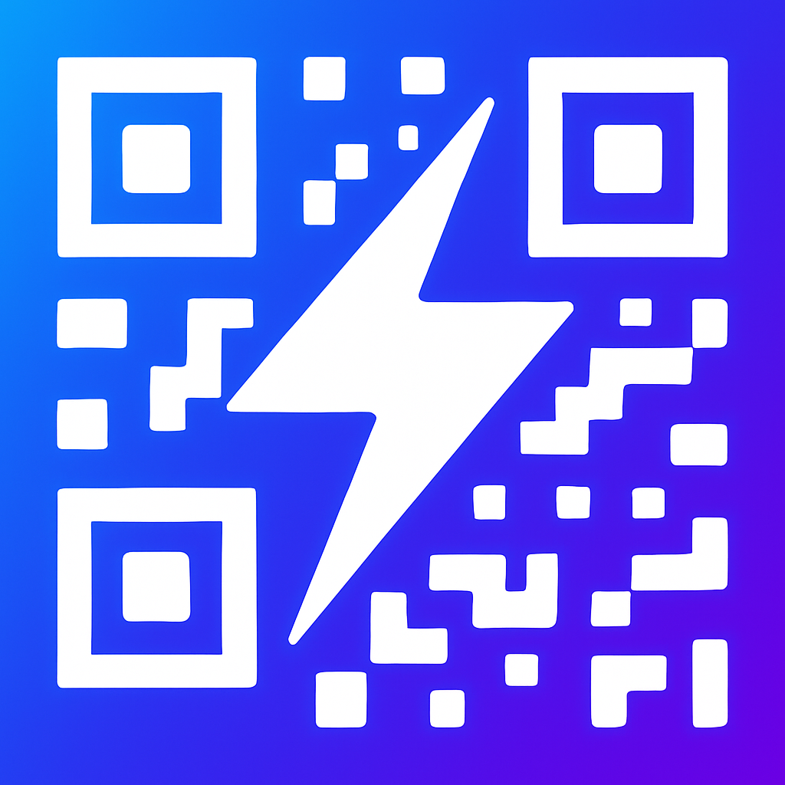

# Privacy Policy for QuickPay QR

  

  

**Effective Date:** September 12, 2025  
**Last Updated:** September 12, 2025

## Introduction

Welcome to QuickPay QR ("we," "our," or "us"). We are committed to protecting your privacy and being transparent about how our app works. This Privacy Policy explains our practices regarding the collection, use, and disclosure of information when you use our mobile application.

**Key Point:** QuickPay QR is designed to work completely offline and does not collect or transmit your personal data to our servers.

## Information We Do NOT Collect

- **Personal Information:** We do not collect names, email addresses, phone numbers, or any other personal identifiers
- **Payment Information:** We do not store or transmit any actual payment details, bank account numbers, or financial information
- **Location Data:** We do not access or collect your device's location
- **Contacts:** We do not access your device's contact list
- **User Accounts:** No registration or account creation is required

## Information That May Be Collected by Third Parties

### Google AdMob

We use Google AdMob to display advertisements in our app. AdMob may collect:

- Device information (device type, operating system, unique device identifiers)
- App usage information for ad serving purposes
- IP address for general location (country/region level)

**Your Control:** You can manage ad personalization through the app settings or by visiting [Google's Ad Settings](https://adssettings.google.com/).

### App Store Analytics

- Apple App Store and Google Play Store may collect basic analytics about app downloads and usage
- This data is aggregated and anonymous

## Local Data Storage

The following data is stored locally on your device and never transmitted:

### Payment Templates

- Saved payment templates with recipient details
- Custom notes and labels
- Stored using secure local storage

### App Preferences

- Theme settings (light/dark mode)
- Language preferences
- PIN lock settings (if enabled)
- Ad consent preferences

### Custom Images

- Any logos or images you add to QR codes
- Processed and stored locally only

## App Permissions

### Required Permissions

- **Storage Access:** To save generated QR codes and PDF invoices to your device
- **Network Access:** Required only for displaying ads (no user data transmitted)

### Optional Permissions

- **Photo Library Access:** To select custom logos for QR codes (only when you choose to add images)

## Advertising

### Ad Personalization

- You can choose between personalized or non-personalized ads
- Personalized ads are based on your interests as determined by Google
- Non-personalized ads are shown based on general factors like your general location and the content you're viewing
- You can change this preference at any time in the app

### Ad Networks

We use Google AdMob, which may work with additional ad networks. These networks may use cookies and similar technologies. For more information, see:

- [Google's Privacy Policy](https://policies.google.com/privacy)
- [Google's Partner Policy](https://policies.google.com/technologies/partner-sites)

## Children's Privacy

Our app is not directed to children under 13. We do not knowingly collect personal information from children under 13. If you are a parent or guardian and believe your child has provided us with personal information, please contact us.

## Your Rights and Choices

### Data Control

- **View Data:** All your data is stored locally and visible within the app
- **Delete Data:** Uninstall the app or clear app data in device settings to remove all local data
- **Export Data:** You can export your templates and QR codes at any time

### Ad Preferences

- **Manage Ads:** Use the "Manage Ad Preferences" button in the app
- **Reset Consent:** Reset your advertising consent to be prompted again
- **Opt-Out:** Visit [Google's Ad Settings](https://adssettings.google.com/) to opt out of personalized ads

## Data Security

- All data processing happens locally on your device
- We use industry-standard security measures for local data storage
- No data transmission to our servers means no risk of data breaches from our side
- Your device's built-in security protects your local data

## International Users

Since our app works offline and doesn't collect personal data:

- No data is transferred internationally
- GDPR, CCPA, and other privacy regulations are respected by design
- Your data stays on your device in your jurisdiction

## Changes to This Privacy Policy

We may update this Privacy Policy from time to time. When we do:

- The "Last Updated" date will be revised
- Significant changes will be announced in the app
- Continued use of the app constitutes acceptance of changes

## Third-Party Services

Our app may contain links to third-party websites or services (like payment processors' websites when you scan QR codes). This Privacy Policy does not apply to those third-party services.

## Contact Us

If you have questions about this Privacy Policy or our privacy practices:

**Email:** <info@syleniainc.com>  
**Response Time:** We aim to respond within 48 hours

## Technical Details

### Data Processing Legal Basis (GDPR)

- **Legitimate Interest:** Displaying ads to support the free app
- **Consent:** Ad personalization (where applicable)
- **Contract Performance:** Providing the core QR generation service

### Data Retention

- Local data: Retained until you delete it or uninstall the app
- Ad data: Managed by Google AdMob according to their retention policies

### Data Minimization

We follow the principle of data minimization by:

- Only requesting necessary permissions
- Not collecting data we don't need
- Processing everything locally when possible

## Compliance

This app is designed to comply with:

- General Data Protection Regulation (GDPR)
- California Consumer Privacy Act (CCPA)
- Children's Online Privacy Protection Act (COPPA)
- Other applicable privacy laws
- In regions where required by law (such as the EU), users are asked for consent before personalized ads are shown.

---

**Remember:** QuickPay QR is built with privacy by design. Your payment information never leaves your device, and we don't have access to your personal data.

For the most current version of this policy, please check this page or the privacy section in the app.
